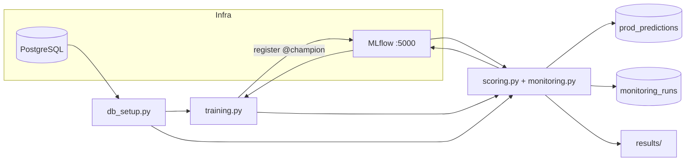

# Entrega — Challenge MLOps (MetLife Insurance)

Documento de resumen para evaluación: qué pedía el challenge, problemas en los datos de producción, cómo se resolvieron, solución implementada, métricas y resultados.

Requisitos originales: [challenge_ml.md](challenge_ml.md).

---

## 1. Resumen del challenge

El repositorio predice el costo de seguro médico (`charges`, en USD) a partir de variables demográficas y de salud (`age`, `sex`, `bmi`, `children`, `smoker`, `region`). El challenge pide evolucionar el pipeline hacia un enfoque **MLOps observable**:

- **Entrenamiento** con MLflow: parámetros, métricas, artefactos y registro del mejor modelo.
- **Scoring** sobre los CSV de `data/prod/`, consumiendo ese modelo (no un `.pkl` manual aislado).
- **Monitoreo simulado** por batch: performance, drift y calidad de schema, con estado consolidado `OK` / `WARNING` / `ALERT`.

El monitoreo **no corrige** anomalías en los datos; las **detecta y clasifica**.

---

## 2. Arquitectura de la solución



**Orden de ejecución** (`entrypoint.sh`): esperar Postgres y MLflow → `db_setup.py` → `training.py` → `scoring.py`.

| Componente | Rol |
|------------|-----|
| `postgres` | `metlife_db` (datos app) + `mlflow_db` (tracking) |
| `mlflow` | UI `http://localhost:5000`, artefactos en `./mlartifacts` |
| `src/training.py` | XGBoost + MLflow + promoción `@champion` |
| `src/scoring.py` | Inferencia prod1/2/3 + persistencia + monitoreo |
| `src/monitoring.py` | PSI, schema, performance por batch |

---

## 3. Problemas con los datos de producción

Los batches en `data/prod/` simulan escenarios reales de degradación. Ejemplos de la **fila 1**:

| Batch | Problema | Ejemplo en archivo | Tras parseo / lectura |
|-------|----------|-------------------|------------------------|
| **prod1** | Target con coma decimal europea (una columna) | `14700,80931` | **14700.81** USD — batch sano |
| **prod2** | Misma estructura, coma “corrida” (~100×) | `1470080,931` | **1470080.93** USD — target corrupto |
| **prod3** | BMI sin punto decimal (×1000), sin target | `bmi=27929` (vs ~27.9 en training) | Covariate drift; sin métricas de performance |
| *(transversal)* | `age` en prod = training + 1 | age 20 vs 19 en fila 1 | Shift leve; no se corrige |

**Features prod1/prod2** son equivalentes entre sí (mismas columnas que training); solo cambia el archivo de target.

---

## 4. Cómo se resolvieron los problemas de datos

### 4.1 Ingesta y parseo del target (`src/scoring.py`)

**Problema técnico:** usar `pd.read_csv(..., decimal=',')` **partía** el valor porque la coma actuaba como separador de columnas (ej. `14700,80931` → dos columnas; se tomaba solo `80931`).


### 4.2 Drift — PSI (`src/monitoring.py`)

**Problema:** bins por **cuantiles** en variables enteras (`age` con corrimiento +1 en todo el batch) generaban PSI ~0.57 y **falsos ALERT** en prod1/prod2.

**Solución:** PSI con bins de **ancho fijo** sobre el rango de `training_dataset`:

- `age` +1 → PSI ~**0.006** (OK).
- `bmi` en prod3 (escala ×1000) → PSI ~**16.5** (ALERT).

### 4.3 Schema / calidad

Reglas fijas: `age` 18–100, `bmi` 10–60, `children` 0–10, dominios categóricos `sex` / `smoker` / `region`. En prod3, **99.9%** de filas violan el rango de `bmi`.

---

## 5. Cómo se resolvió el challenge (checklist)

| Requisito (`challenge_ml.md`) | Implementación |
|------------------------------|----------------|
| MLflow en entrenamiento | Experimento `metlife_insurance`, params/métricas/artefactos por run |
| Mejor modelo registrado | Model Registry `metlife_insurance_xgb`, alias **`@champion`** |
| Criterio de mejor modelo | Menor **`validation_rmse`** en USD (`promote_if_better` en `training.py`) |
| Scoring desde artefacto MLflow | `models:/metlife_insurance_xgb@champion` (fallback `models/best_model.pkl`) |
| Procesar `data/prod/` | prod1, prod2 (con target), prod3 (sin target) |
| Salida reproducible | Tablas `prod_predictions`, `monitoring_runs`; reportes `results/monitoring_report_*` |
| Monitoreo OK/WARNING/ALERT | Tres ejes en `monitoring.py`; estado = peor eje |
| Docker / env | `docker-compose.yaml`, `.env.template`, `MLFLOW_*` |

**Modelo:** XGBoost en `Pipeline` (OneHot + regresión), target `log1p(charges)`, mismas features derivadas en train y score (`utils.feature_engineering`).

**Champion — hiperparámetros (última corrida):**

| Parámetro | Valor |
|-----------|-------|
| learning_rate | 0.05 |
| max_depth | 3 |
| n_estimators | 300 |
| reg_alpha | 0.1 |
| reg_lambda | 100 |

Ver también: `models/best_model_metadata.json` y run de MLflow asociado al `@champion`.

---

## 6. Métricas e indicadores

### 6.1 Entrenamiento

Métricas en **dólares** (predicciones con `expm1` tras entrenar en log):

| Métrica | Train | Validation |
|---------|-------|------------|
| RMSE | $4,202 | **$4,897** (baseline monitoreo) |
| MAE | $1,869 | $2,251 |
| R² | 0.880 | 0.831 |
| Adjusted R² | 0.879 | 0.823 |
| MAPE | 14.2% | 17.8% |

**Overfitting:** `R²_train − R²_val` ≈ **0.049** (aceptable).

La búsqueda de hiperparámetros (`RandomizedSearchCV`) optimiza MSE en escala **log**; la promoción a champion usa solo **RMSE de validación en $**.

### 6.2 Monitoreo por batch (tres ejes)

El **estado del batch** es el **peor** entre performance, drift y schema.

| Eje | Indicadores | Umbrales |
|-----|-------------|----------|
| **Performance** (si hay target) | RMSE, MAE, R², MAPE, **rmse_ratio** = RMSE_batch / RMSE_baseline | ratio &lt; 1.25 OK; 1.25–2.0 WARNING; &gt; 2.0 ALERT |
| **Drift** | **PSI** por `age`, `bmi`, `children`, `sex`, `smoker`, `region` vs `training_dataset` | PSI &lt; 0.1 OK; 0.1–0.25 WARNING; ≥ 0.25 ALERT |
| **Schema** | % filas fuera de rango o categoría inválida | 0% OK; &gt; 0% WARNING; &gt; 5% ALERT |

**PSI (Population Stability Index):** mide cuánto cambió la distribución de una variable entre referencia (training) y el batch. Se comparan proporciones por bins; valores altos indican que los datos de entrada ya no se parecen a los de entrenamiento (no mide calidad de predicción por sí solo).

---

## 7. Resultados finales (corrida validada)

Fuente: `results/monitoring_report_20260603_100049.json` (1.338 filas por batch).

| Batch | Estado | Performance | Drift (max PSI) | Schema | Interpretación |
|-------|--------|-------------|-----------------|--------|----------------|
| **prod1** | **OK** | RMSE $4,843; ratio **0.99×**; R² 0.85 | 0.006 | 0% | Pipeline sano; modelo alineado al baseline |
| **prod2** | **ALERT** | RMSE $1.79M; ratio **366×**; R² −1.12 | 0.006 (OK) | 0% (OK) | Target corrupto; features y modelo coherentes |
| **prod3** | **ALERT** | *(sin target)* | **16.54** (bmi) | **99.9%** viol. bmi | Drift de covariables; sin evaluar performance |

**Por batch en una frase:**

- **prod1:** referencia de producción correcta.
- **prod2:** demuestra detección de **target drift** sin confundirlo con drift de features.
- **prod3:** demuestra **covariate drift** y fallo de schema cuando no hay etiquetas.

---

## 8. Reproducir y evidencia

```powershell
cd \metlife-challenge-mlops

# Pipeline completo
docker compose up --build

# Solo re-entrenar y re-scorear (con postgres + mlflow arriba)
docker compose up -d postgres mlflow
docker compose run --rm ml_pipeline python src/training.py
docker compose run --rm ml_pipeline python src/scoring.py
```

| Evidencia | Dónde |
|-----------|--------|
| MLflow UI | http://localhost:5000 — experimento `metlife_insurance`, modelo `@champion`, runs `train_*` y `score_prod*` |
| Hiperparámetros y métricas del champion | `models/best_model_metadata.json` |
| Reporte de monitoreo legible | `results/monitoring_report_*.txt` |
| Predicciones en DB | tabla `prod_predictions` |
| Resumen por batch en DB | tabla `monitoring_runs` |

---

## 9. Decisiones documentadas (ambigüedades)

- **Target prod:** una columna con coma decimal; no se “arregla” prod2 en ingestión.
- **Champion:** solo compara `validation_rmse` en USD; no MAE ni R².
- **PSI:** bins de ancho fijo (no cuantiles) para evitar falsos positivos en `age`.
- **Baseline de monitoreo:** RMSE de validación del champion local (`best_model_metadata.json`).

---

*Autor: Lucas Gaggino — Challenge MLOps MetLife*
